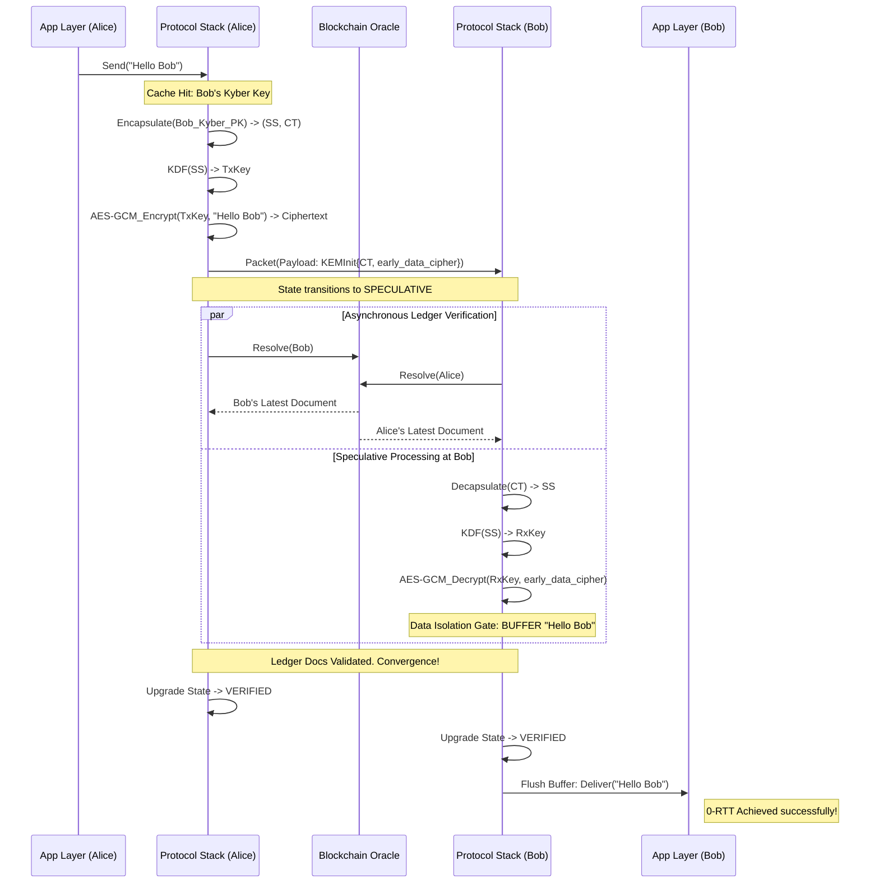

# Atrium Protocol Specification

> **Version:** 1.1.0 (Formal Draft)
> **Status:** Draft Standard
> **Transport Layer:** TCP (Length-Prefixed) / WebSocket + Protobuf
> **Security Model:** Fully Post-Quantum Data Plane, Hybrid Trust Anchor, Speculative Execution

---

## 1. Architectural Overview & Cryptographic Suite

Atrium is a decentralized Authenticated Key Exchange (AKE) protocol designed to resolve the "Security-Latency Paradox" in Decentralized Identifier (DID) networks. It employs a **Privilege Separation Model** to balance ledger storage constraints with post-quantum security requirements against "Harvest Now, Decrypt Later" adversaries.

### 1.1 Cryptographic Primitives

The protocol strictly enforces the following cryptographic suite:

1.  **Trust Anchor (DID Document Controller)**: `Ed25519`
    *   *Usage*: Anchoring the DID on the ledger. Ed25519 is retained for root capabilities to prevent blockchain state-bloat and to maintain compatibility with BIP-39 mnemonic recovery.
2.  **Ephemeral Authentication (Handshake Signatures)**: `Dilithium3` (ML-DSA-65)
    *   *Usage*: All on-the-wire identity authentication during the handshake phase is strictly post-quantum.
3.  **Key Encapsulation Mechanism (KEM)**: `Kyber768` (ML-KEM-768)
    *   *Usage*: Post-quantum shared secret establishment.
4.  **Hash & Ratchet KDF**: `SHA3-384`
    *   *Usage*: All hashing, HKDF, and HMAC operations use SHA3-384 to guarantee a 192-bit quantum security margin (NIST Level 3).
5.  **Symmetric Encryption**: `AES-256-GCM`
    *   *Usage*: Application payload encryption.

---

## 2. Protocol Envelopes & Wire Format

All network transmissions in Atrium are serialized via Protocol Buffers (`proto3`). The protocol adopts a strict **"Sign-then-Encrypt"**-inspired envelope architecture, where a macroscopic `Credential` protects the integrity and authenticity of the entire underlying packet.

### 2.1 The Atrium Packet

The root message on the wire is the `Packet`.

```protobuf
message Packet {
  Header header = 1 [(buf.validate.field).required = true]; 

  oneof payload {
    option (buf.validate.oneof).required = true;
    KEMInit kem_init = 10;
    KEMConfirm kem_confirm = 11;
    SecureMessage secure_message = 12;
    AppMessage app_message = 13;
    Error error = 14;
  }

  // The Credential protects the integrity of the Header + Payload.
  Credential credential = 2;
}
```

### 2.2 Standard Header

Every packet explicitly declares the sender's perceived `SessionState`. This is a critical design choice that forces state synchronization and enables rapid Byzantine fault detection.

```protobuf
message Header {
  SessionState session_state = 1;
  Code         code          = 2;
  string       request_id    = 3;
  string       from_did      = 4; // Format: "^did:[a-z0-9]+:.*$"
  string       to_did        = 5;
  int64        timestamp     = 6;
}
```

### 2.3 The 0-RTT Speculative Handshake Envelope (`KEMInit`)

To achieve 0-RTT, Atrium embeds Early Data directly within the key establishment frame. 

```protobuf
message KEMInit {
  bytes ct                = 1; // Kyber768 Ciphertext (1088 bytes)
  bytes nonce             = 2; // 32-byte cryptographic nonce
  
  // 0-RTT: Speculative Early Data
  SecureMessage early_data_cipher = 3; 
}
```

### 2.4 Secure Payload (`SecureMessage`)

All application-layer plaintexts are encapsulated as opaque byte streams (`ciphertext`) within a `SecureMessage`. The Atrium transport layer **never** inspects the underlying application data.

```protobuf
message SecureMessage {
  uint64 sequence_number = 1;                                      
  bytes  ciphertext      = 2; // Encrypted AppMessage
  bytes  nonce           = 3; // 12-byte AES-GCM nonce 
  bytes  tag             = 4; // 16-byte Auth Tag  
}
```

---

## 3. Protocol State Machine & Data Isolation Gate (DIG)

Atrium's zero-round-trip (0-RTT) capability is achieved via **Speculative Authenticated Key Exchange (S-AKE)**. 

| State | Symbol | Semantic | Inbound Processing Rule |
| :--- | :--- | :--- | :--- |
| **IDLE** | $S_{idle}$ | Uninitialized. | Reject all. |
| **SPECULATIVE** | $S_{spec}$ | Handshake complete via local cache; asynchronous ledger verification pending. | **ISOLATE**: Decrypt ciphertext but buffer it. **MUST NOT** deliver to application. |
| **VERIFIED** | $S_{ver}$ | Ledger proof verified. Identity is authentic. | **DELIVER**: Flush buffer to application layer; process new messages synchronously. |
| **ABORTED** | $S_{abort}$ | Cryptographic failure or ledger mismatch. | **DROP**: Destroy keys, clear buffer, terminate connection. |

### 3.1 The "Data Isolation Gate" (DIG) Normative Rule
When a `SecureMessage` arrives while the session is in $S_{spec}$, the implementation **MUST** execute the ratchet KDF and decrypt the AES-GCM payload to maintain cryptographic state synchronization. However, the resulting plaintext **MUST** be placed into an isolated memory buffer. Calling the application-layer delivery callback (e.g., `OnMessage`) prior to reaching $S_{ver}$ constitutes a critical protocol violation.

---

## 4. The 0-RTT S-AKE Flow

The following sequence diagram outlines the 0-RTT optimistic execution path, demonstrating how Early Data successfully bypasses consensus latency without compromising eventual security.



---

## 5. Security & Implementation Considerations

### 5.1 Entropy Decay & Epoch-KEM (Q-Ratchet)
To mitigate the large size of post-quantum ciphertexts, Atrium utilizes a symmetric Hash Ratchet (via SHA3-384 HKDF) for per-message forward secrecy. However, pure hash ratchets lack Post-Compromise Security (PCS). Implementations **MUST** monitor the entropy risk budget (a function of time elapsed and messages sent). Upon exceeding the risk threshold $\Theta_{risk}$, the client **MUST** inject a new `KEMInit` packet (an Epoch-KEM) to refresh the quantum entropy of the session chain.

### 5.2 Atomic Verification Aborts
If asynchronous ledger verification returns a mismatch (e.g., the local cached key was rotated/revoked by the owner on-chain), the client **MUST** immediately:
1. Send an `Error` packet with code `CODE_ERROR_VERIFICATION_FAILED` to proactively alert the peer.
2. Enter $S_{abort}$.
3. Erase all derived keys.
4. Purge the Isolation Buffer, ensuring dirty plaintexts are permanently destroyed.
