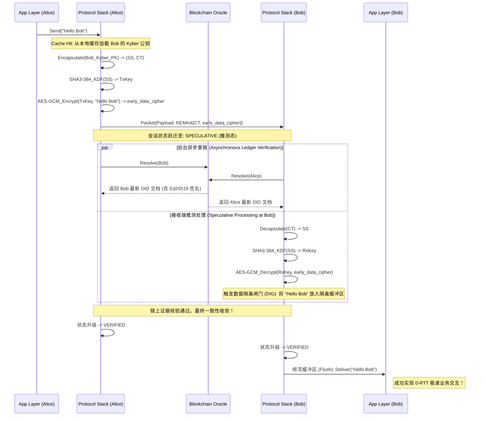

# Atrium 协议规范 (Atrium Protocol Specification)

> **版本:** 1.1.0 (Formal Draft)
> **状态:** 协议草案 (Draft Standard)
> **传输层:** TCP (Length-Prefixed) / WebSocket + Protobuf
> **安全模型:** 纯后量子数据面 (Fully Post-Quantum Data Plane)、混合信任锚 (Hybrid Trust Anchor)、推测式执行 (Speculative Execution)

---

## 1. 摘要 (Executive Summary)

Atrium 是一种去中心化的认证密钥交换 (AKE) 协议。其核心创新在于解决了去中心化身份 (DID) 网络中的 **“安全-延迟悖论”**。通过引入 **推测式执行 (Speculative Execution)** 和 **异步身份验证 (Asynchronous Verification)**，Atrium 实现了 0-RTT 的会话启动速度，同时保证了强一致性的后量子安全底线。

---

## 2. 架构概述与密码学套件 (Architectural Overview & Cryptographic Suite)

Atrium 采用 **特权分离模型 (Privilege Separation Model)**，在满足严格的后量子安全需求（防范“先存储后破解”攻击）的同时，避免了区块链状态爆炸和助记词不兼容的问题。

协议严格强制使用以下密码学套件：

1. **信任锚点 (DID 文档主控与声明)**: `Ed25519`
   * *用途*: 仅用于在分布式账本上锚定 DID 文档。保留经典椭圆曲线算法以极大地降低上链成本，并保持与传统 BIP-39 助记词恢复体系的兼容性。
2. **瞬时身份认证 (握手签名)**: `Dilithium3` (ML-DSA-65)
   * *用途*: 网络传输层面的所有握手身份证明均使用此纯后量子签名标准。
3. **密钥封装机制 (KEM)**: `Kyber768` (ML-KEM-768)
   * *用途*: 用于 0-RTT 握手期间的后量子共享秘密 (Shared Secret) 建立。
4. **哈希与棘轮密钥派生 (Hash & Ratchet KDF)**: `SHA3-384`
   * *用途*: 所有哈希、HKDF 和 HMAC 操作均采用 SHA3-384，确立 192-bit 的抗量子强度 (NIST Level 3 安全边际)。
5. **对称加密机制**: `AES-256-GCM`
   * *用途*: 对应用层载荷 (AppMessage) 进行认证加密。

---

## 3. 协议消息格式与 0-RTT 载荷 (Protocol Message Formats)

所有网络层报文均通过 Protocol Buffers (proto3) 序列化。Atrium 采用严格的 **先签名后加密 (Sign-then-Encrypt)** 信封架构。

### 3.1 顶层信封：Packet

`Packet` 是网络传输的根结构。外层的 `Credential` 为内部的 `Header` 与 `Payload` 提供了宏观的完整性与真实性保护。

| 字段名 | 类型 | 校验规则 / 约束 | 说明 |
| :--- | :--- | :--- | :--- |
| `header` | Header | 必填 (Required) | 包含路由、状态与时间戳信息的标准报头。 |
| `payload` | oneof | 必选其一 | 承载具体的协议指令（如握手、密文、错误）。 |
| `credential` | Credential | 可选 / 视负载而定 | 包含 `Dilithium3` 生成的签名。保护对象为序列化后的 (Header + Payload) 字节流。 |

### 3.2 标准报头：Header

每次网络传输都必须显式声明发送方当前认定的 `SessionState`。这是核心的工程设计，用于强制状态同步，并极大地加速拜占庭容错与状态不一致（如脑裂）的发现。

| 字段名 | 类型 | 描述与设计用意 |
| :--- | :--- | :--- |
| `session_state` | enum | 枚举值 (IDLE, SPECULATIVE, VERIFIED, ABORTED)。指示发送方的局部状态机阶段。 |
| `code` | enum | 状态码，通常在发送状态告警或响应时使用（如 CODE_SUCCESS, CODE_ERROR_VERIFICATION_FAILED）。 |
| `request_id` | string (UUID) | 报文溯源 ID，用于 RPC 风格的请求-响应匹配。 |
| `from_did` | string | 发送方 DID (正则约束: `^did:[a-z0-9]+:.*$`)。用于中继路由与身份查找。 |
| `to_did` | string | 接收方 DID。 |
| `timestamp` | int64 | 毫秒级时间戳，用于防重放攻击初筛。 |

### 3.3 0-RTT 推测式握手首包：KEMInit

`KEMInit` 是实现 0-RTT (Early Data) 的关键载荷。它允许发起方在建立密钥的同时，搭载经过该密钥加密的业务首包。

| 字段名 | 类型 | 长度约束 | 核心用意与密码学逻辑 |
| :--- | :--- | :--- | :--- |
| `ct` | bytes | 固定 1088 字节 | **Kyber768 密文**。发起方使用本地缓存的对端 Kyber 公钥封装产生的密文。 |
| `nonce` | bytes | 固定 32 字节 | 密码学随机数，用于防御重放攻击以及作为密钥派生函数的输入盐值 (Salt)。 |
| `early_data_cipher`| SecureMessage| 变长 | **0-RTT 早期数据**。发起方基于刚刚通过 Kyber768 协商出的对称密钥，对首条业务指令进行 AES-256-GCM 加密后直接嵌入此处。 |

### 3.4 握手确认包：KEMConfirm
| 字段名 | 类型 | 长度约束 | 说明 |
| :--- | :--- | :--- | :--- |
| `nonce_hash` | bytes | 固定 32 字节 | 对 `KEMInit` 中 `nonce` 的 SHA3-384 哈希值，用于双向确认 (Handshake Confirmation)。 |

### 3.5 安全载荷包：SecureMessage

`SecureMessage` 结构对底层网络层**完全屏蔽**了应用数据的内容。

| 字段名 | 类型 | 说明 |
| :--- | :--- | :--- |
| `sequence_number`| uint64 | 严格递增的序列号。用于哈希棘轮 (Q-Ratchet) 的同步与防重放。 |
| `ciphertext` | bytes | 被 AES-256-GCM 加密的应用层明文 (AppMessage)。 |
| `nonce` | bytes | 固定 12 字节。AES-GCM 加密所用的随机数。 |
| `tag` | bytes | 固定 16 字节。AES-GCM 输出的认证标签 (Authentication Tag)，用于密文防篡改。 |

---

## 4. 协议状态机与数据隔离闸门 (Protocol State Machine & DIG)

Atrium 的安全性建立在严格的状态机逻辑之上。

| 状态 (State) | 符号 | 描述 | 数据处理策略 |
| :--- | :--- | :--- | :--- |
| **初始态 (IDLE)** | S_idle | 会话尚未建立。 | 不允许收发。 |
| **推测态 (SPECULATIVE)** | S_spec | 握手基于本地缓存完成，异步查链中。 | **允许发送**；**隔离接收**（解密但不交付应用层）。 |
| **确权态 (VERIFIED)** | S_ver | 后台查链完成，身份已获账本真值验证。 | **全双工交付**（开放闸门，推送隔离缓冲区消息）。 |
| **中止态 (ABORTED)** | S_abort | 验证失败或协议违规，会话永久失效。 | **物理熔断**（销毁密钥，清空隔离缓冲区，关闭连接）。 |

### 4.1 数据隔离策略的刚性约束 (Normative Rule for DIG)

处于 S_spec 状态时，协议栈必须维持一个 **隔离缓冲区 (Isolation Buffer)**。
*   **入站处理的硬性规定**: 收到 `SecureMessage` 或 `early_data_cipher` 后，接收方**必须 (MUST)** 执行 Q-Ratchet 演化密钥并完成 AES-GCM 解密以保持密码学状态同步。但是，解密后的明文**严禁 (MUST NOT)** 在状态转移至 S_ver 之前交付给应用层的回调函数（如 OnMessage）。提前交付将构成高危的协议违规。

---

## 5. 0-RTT 推测式执行工作流 (The 0-RTT S-AKE Flow)

Atrium 将身份验证解耦为“证明携带型”的异步过程。以下流程展示了 0-RTT 是如何规避区块链延迟的：

---

## 6. 扩展 eBR 安全模型定义 (Extended eBR Security Model)

本节基于扩展的 Bellare-Rogaway (eBR) AKE 安全模型，引入了推测状态约束与棘轮演化博弈，对 Atrium 协议进行数学归约证明。

### 6.1 协议实例与会话标识 
设 P 为协议参与者集合。每个参与者 i 可以并发执行多个协议实例，记为 Π(i, s)，其中 s 为本地会话索引。

**会话标识符 (Session ID, sid)**:
一个唯一的字符串，用于绑定一次特定的密钥交换执行。定义为交互报文的哈希：
sid = Hash(N_init || N_confirm || pk_i || pk_j || ct)

### 6.2 敌手预言机查询 (Adversary Oracle Queries)
敌手 A 是一多项式时间 (PPT) 算法，可通过以下预言机与系统交互：

*   **Send(i, s, M)**: 向实例 Π(i, s) 发送消息 M 并获取响应。
*   **Corrupt(i)**: 泄露参与者 i 的长期主控签名私钥 (Ed25519)。
*   **Reveal(i, s)**: 泄露实例 Π(i, s) 的当前会话密钥 SK。
*   **ResolveDelay(DID, Δt)**: 允许 A 拦截并延迟 $\mathcal{O}_{resolve}$ 针对特定 DID 的身份真实性证明投递，人为延长推测窗口。
*   **Test(i, s)**: 挑战者抛硬币 b ∈ {0,1}。若 b=0，返回真实 SK；若 b=1，返回随机均匀字符串。A 需要输出猜测 b'。

---

## 7. Q-Ratchet 的形式化安全模型 (Ratchet Security Game)

Q-Ratchet 是 Atrium 基于 SHA3-384 HKDF 链构建的状态演化机制。
设内部状态为 St_i，消息密钥为 MK_i。演化函数：(St_{i+1}, MK_i) ← Ratchet(St_i)

### 7.1 前向安全 (Forward Secrecy, PFS)
**定义**: 若 A 调用 StateReveal(i, s, t) 获取了状态 St_t，她仍无法在 Test(i, s, t') (其中 t' < t) 中取得不可忽略的优势。
*   **证明支撑**: 基于 SHA3-384 函数的单向性与抗原像攻击特性。

### 7.2 基于动态阈值的后向安全 (Post-Compromise Security, PCS)
纯哈希棘轮不具备 PCS。Atrium 引入 **基于概率熵衰减的 Epoch-KEM 注入**。
*   **定量风险模型**: 设距离上次 Kyber768 KEM 注入已过去时间 Δt_kem，期间发送了 n 条消息。设基于时间的侧信道泄露系数为 λ_t，基于数据量的统计泄露系数为 λ_n。状态被敌手提取的累计风险指数衰减模型为：
    Risk(Δt_kem, n) = 1 - exp(-(λ_t * Δt_kem + λ_n * n))
*   **轮换策略**: 定义安全上限阈值 Θ_risk。当 Risk(Δt_kem, n) > Θ_risk 时，协议强制执行一次全新的 Kyber768 KEM 握手，将新的后量子供享秘密混入当前 St。

---

## 8. 安全性归约证明概要 (Proof Sketch via Game-Hopping)

**定理 1**: 假设 Dilithium3 满足 EUF-CMA，Kyber768 满足 IND-CCA2，且底层共识协议提供最终确定性 F(k)，则 Atrium 满足 EALA 认证性及 IND-CCA2 机密性。

### Game 0 (真实博弈)
A 攻击真实协议。

### Game 1 (剥夺伪造能力)
修改挑战者：若 A 提交了未经诚实方生成的合法 Dilithium3 签名，触发 Abort。基于 EUF-CMA 假设，差值为 ε_sig。此时保证了匹配会话的前提。

### Game 2 (剥夺密文区分能力)
在 Test 查询中，将 Kyber768 真实输出替换为理想随机数。基于 IND-CCA2 假设，差值为 ε_kem。此时证明了协议的基础 Semantic Security。

### Game 3 (证明携带与推测隔离)
处理 EALA 违规。A 唯一的路径是提供非法的有效性证明（如伪造的账本状态）。由于 DIG 机制限制 Deliver 仅在状态跳转为 VERIFIED 后执行，A 成功的概率被严格约束于共识系统的故障率：
Pr[EALA violation] ≤ P_reorg(k) + ε_consensus

**结论**: Atrium 协议在满足标准 AKE 属性的同时，通过 DIG 与参数化验证机制，将异步网络的延迟漏洞归约为了底层区块链共识的鲁棒性问题。

---

## 9. 理论贡献总结 (Theoretical Framework & Core Capabilities)

| 能力 | 工程实现视角 | 密码学与协议理论视角 |
| :--- | :--- | :--- |
| **0-RTT 极速启动** | 命中本地缓存后的 `early_data` 乐观首发。 | **S-AKE**: 针对高延迟分布式信任锚点的推测执行模型。 |
| **隔离防御机制** | 网络包解密后驻留缓冲区，拦截业务层回调。 | **DIG**: 数据隔离闸门。推测窗口内切断副作用交付的物理策略。 |
| **异步确权升级** | 本地核验轻客户端证明 (SPV/聚合签名) 的一致性。 | **Proof-Carrying Resolution**: 规避时延悖论的基于共识证据的确权转换。 |
| **后量子 PFS/PCS**| SHA3-384 哈希链结合自适应 Kyber768 轮换。 | **Q-Ratchet**: 面向资源受限环境的、基于概率熵衰减的混合量子熵注入演化函数。 |