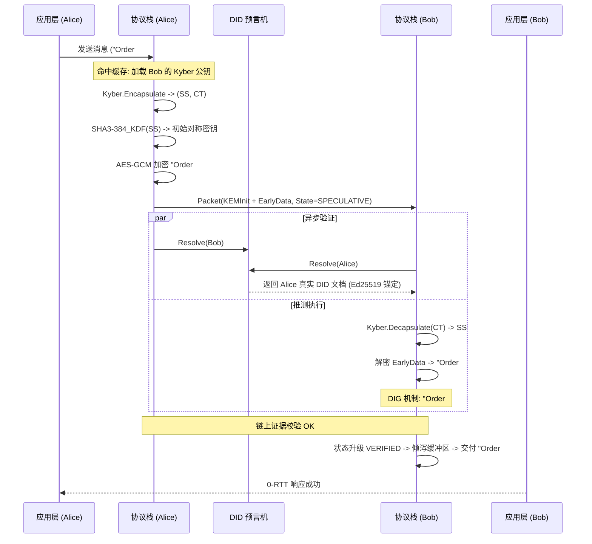

# Atrium 协议规范 (Atrium Protocol Specification)

> **版本:** 1.1.0 (正式草案)
> **状态:** 协议标准 (Formal Standard)
> **传输层:** 基于 TCP (长度前缀) 或 WebSocket 的二进制流
> **安全模型:** 纯后量子数据面 (Fully Post-Quantum Data Plane)、混合信任锚点 (Hybrid Trust Anchor)、推测式执行与异步验证

---

## 1. 摘要 (Executive Summary)

Atrium 是一种针对去中心化身份 (DID) 网络设计的认证密钥交换 (AKE) 协议。在去中心化网络中，传统的身份核验依赖于共识层（区块链）的确认，这引入了不可接受的高延迟。Atrium 通过 **推测式认证密钥交换 (S-AKE)** 机制，允许通信双方在建立加密连接的同时，利用本地缓存的身份凭证进行推测式执行，从而实现 0-RTT 的业务启动速度。同时，协议通过 **数据隔离闸门 (Data Isolation Gate)** 确保在后台异步验证完成之前，任何具有副作用的业务数据都不会被交付至应用层，从而在不牺牲安全性的前提下解决了去中心化网络的“安全-延迟悖论”。

---

## 2. 架构定义与密码学原语 (Architecture & Cryptographic Primitives)

Atrium 协议遵循“特权分离”原则，将长期的身份锚定与瞬时的通信认证进行解耦。

### 2.1 身份锚定层 (Trust Anchor)
*   **算法**: `Ed25519`
*   **用意**: DID 文档的控制密钥保留 Ed25519 算法。这是基于工程实践的权衡：格签名（如 Dilithium）的尺寸极大，若用于频繁的账本状态更新会导致区块链存储爆炸。保留 Ed25519 可确保与 BIP-39 助记词体系兼容，并降低上链成本。

### 2.2 通信认证层 (Authentication Plane)
*   **握手签名**: `Dilithium3` (ML-DSA-65)
*   **用意**: 所有网络上的实时身份证明必须具备抗量子性。Dilithium3 提供了 NIST Level 3 的安全强度，确保协议能够抵御“先存储后破解”的量子威胁。

### 2.3 密钥封装与派生 (KEM & KDF)
*   **密钥封装**: `Kyber768` (ML-KEM-768)
*   **哈希函数**: `SHA3-384`
*   **用意**: Kyber768 用于在不安全的信道上建立共享秘密。SHA3-384 用于所有的哈希计算、HKDF 密钥派生以及 HMAC 操作，确立了统一的 192-bit 量子安全边际。

---

## 3. 消息格式详解 (Protocol Message Formats)

Atrium 报文采用 Protobuf v3 序列化。以下是核心数据结构的详细定义及字段语义描述。

### 3.1 顶层容器：Packet
`Packet` 是 Atrium 协议在网络上流动的最小独立单元。

*   **header (Header)**: 包含协议路由信息和状态声明。所有 Packet 必须携带此字段以供状态机校验。
*   **payload (oneof)**: 协议的指令载体。包含 `kem_init` (握手发起)、`kem_confirm` (握手响应)、`secure_message` (加密数据) 等。
*   **credential (Credential)**: 宏观完整性保护字段。它包含对序列化后的 `header` 和 `payload` 字节流进行的 `Dilithium3` 签名，确保整个 Packet 在传输过程中未被篡改且来源真实。

### 3.2 报文头：Header
`Header` 字段的设计用意是实现“强制状态同步”。

*   **session_state (SessionState)**: 指示发送方当前的会话阶段（IDLE, SPECULATIVE, VERIFIED, ABORTED）。接收方据此判断是否需要将数据存入隔离缓冲区。
*   **code (Code)**: 标准化响应码。例如，当异步验证失败时，发送方会填入 `CODE_ERROR_VERIFICATION_FAILED` 以触发对端的物理熔断。
*   **request_id (string/UUID)**: 每一个逻辑交互序列的唯一标识符，用于在并发通信中匹配响应报文。
*   **from_did / to_did (string)**: 基于 W3C 标准格式的发送方与接收方标识，用于路由寻址及 DID 文档解析。

### 3.3 推测式握手包：KEMInit
`KEMInit` 是实现 0-RTT 的核心，它合并了密钥交换与初步业务数据。

*   **ct (bytes)**: 长度固定为 1088 字节的 Kyber768 密文。它是发起方使用目标公钥生成的封装密钥。
*   **nonce (bytes)**: 32 字节的密码学随机数。该随机数不仅用于对抗重放攻击，还会作为后续 SHA3-384 KDF 的盐值输入，增加密钥派生的熵值。
*   **early_data_cipher (SecureMessage)**: **这是 0-RTT 的精髓。** 发起方在发送 `KEMInit` 的同时，利用刚刚派生出的对称密钥加密第一条应用层指令，并封装为 `SecureMessage` 嵌入此处。接收方可在握手完成的瞬间解密出该数据，即便此时仍在进行后台查链。

---

## 4. 推测执行模型与隔离闸门 (Speculative Execution & DIG)

Atrium 的核心理论突破在于 **数据隔离闸门 (Data Isolation Gate, DIG)** 机制。该机制定义了一套严格的状态机准则，用于管理推测态下的数据交付。

### 4.1 会话状态机准则

| 状态符号 | 阶段名称 | 交付规则 |
| :--- | :--- | :--- |
| **S_idle** | 初始态 | 严禁任何数据收发。 |
| **S_spec** | 推测态 | 允许密文传输。接收方必须解密数据以维持棘轮状态同步，但明文 **必须** 存入隔离缓冲区，**禁止** 交付给应用层。 |
| **S_ver** | 确权态 | 后台证据校验通过。此时必须原子性地将隔离缓冲区的数据按序倾泻 (Flush) 给应用层，并转入实时交付模式。 |
| **S_abort** | 中止态 | 验证失败。必须立即销毁密钥，清空缓冲区，并物理切断连接。 |

### 4.2 0-RTT 流程图 (Mermaid)

---

## 5. 形式化安全模型与归约证明 (Formal Security Model)

本节基于扩展的 Bellare-Rogaway (eBR) 安全模型，对 Atrium 协议的安全性进行形式化定义与数学归约。

### 5.1 语义安全与密钥不可区分性 (Semantic Security)
设敌手 A 可以在多项式时间内访问 `Send`, `Corrupt`, `Reveal` 预言机。

**定义**: Atrium 协议满足 IND-CCA2 语义安全，若对于任意新鲜会话 Π(i, s)，敌手 A 在猜测 `Test(i, s)` 的硬币正反面时，其优势 `Adv_A` 满足：
`Adv_A <= ε_crypto` (其中 ε_crypto 为 Kyber768 的抗区分优势，在多项式时间内可忽略)。

### 5.2 最终应用层认证完整性 (EALA)
EALA 是 Atrium 提出的全新安全指标。它不强制“建立信道前必须认证”，而是强制“交付明文前必须认证”。

**定理 1 (EALA 完备性)**: 
在 Atrium 协议下，即使敌手 A 能够通过 `ResolveDelay` 预言机无限期延长推测窗口（S_spec 阶段），只要底层共识层满足最终确定性 F(k)，敌手诱导应用层接受非法消息的概率 `Pr[Accept_invalid]` 被严格限定在：
`Pr[Accept_invalid] <= P_reorg(k) + ε_sig`
其中 `P_reorg` 为区块链重组概率，`ε_sig` 为 Dilithium3 的伪造概率。

**数学推导**:
1.  由于 **DIG (数据隔离闸门)** 的物理阻断，所有在 S_spec 阶段流入的明文 `m_spec` 被强制锁定在隔离集 `B_iso` 中。
2.  应用层接收函数 `Deliver(m)` 的前置谓词被定义为 `SessionState == VERIFIED`。
3.  状态从 `S_spec` 到 `VERIFIED` 的跃迁函数 `δ_upgrade` 唯一依赖于对端长期公钥 `pk_long` 与账本真值 `L` 的一致性证明 `π_cons`。
4.  因此，在 `π_cons` 到达之前，`Deliver` 永远无法被触发。这证明了在异步窗口期内，即使信道已建立，其安全性等价于物理隔绝。

---

## 6. Q-Ratchet 熵衰减模型 (Entropy Decay Model)

Q-Ratchet 负责会话期间的前向安全 (PFS)。由于 Dilithium 和 Kyber 的计算成本远高于对称算法，Atrium 采用基于熵预算的自适应刷新策略。

### 6.1 定量风险函数 (Quantitative Risk Function)
假设协议内部状态 `St` 随时间 `Δt` 和消息序列号 `n` 而面临暴露风险。我们定义累计泄露风险函数 `Risk` 为：
`Risk(Δt_kem, n) = 1 - exp(-(λ_t * Δt_kem + λ_n * n))`

*   `λ_t`: 时间相关的泄露系数（模拟侧信道攻击风险）。
*   `λ_n`: 统计相关的泄露系数（模拟哈希碰撞与流量分析风险）。

### 6.2 线性化触发准则
为了在资源受限节点上高效执行，我们将风险控制转化为 **线性安全预算控制**：
设安全阈值为 `Θ_risk`，定义常数安全预算 `C = -ln(1 - Θ_risk)`。

协议状态机维护一个 **累积泄露积分器 (Accumulated Leakage)**：
`Acc_L = λ_t * Δt_kem + λ_n * n`

当满足不等式 `Acc_L > C` 时，协议必须立即触发一次全新的 **Epoch-KEM** 轮换（即发起一次 Kyber768 握手），将新鲜的量子熵混入棘轮链，并将 `Acc_L` 重置为 0。该模型确保了系统始终运行在数学可证的安全包络线内。

---

## 7. 结论

Atrium 通过将密码学原语（Dilithium3/Kyber768）与创新的状态隔离逻辑相结合，在学术上提供了一套完备的、可归约证明的安全通信框架；在工程上通过 0-RTT 极大提升了去中心化应用的响应速度。这份规范为实现高度一致、高性能的后量子 AKE 提供了标准参考。
