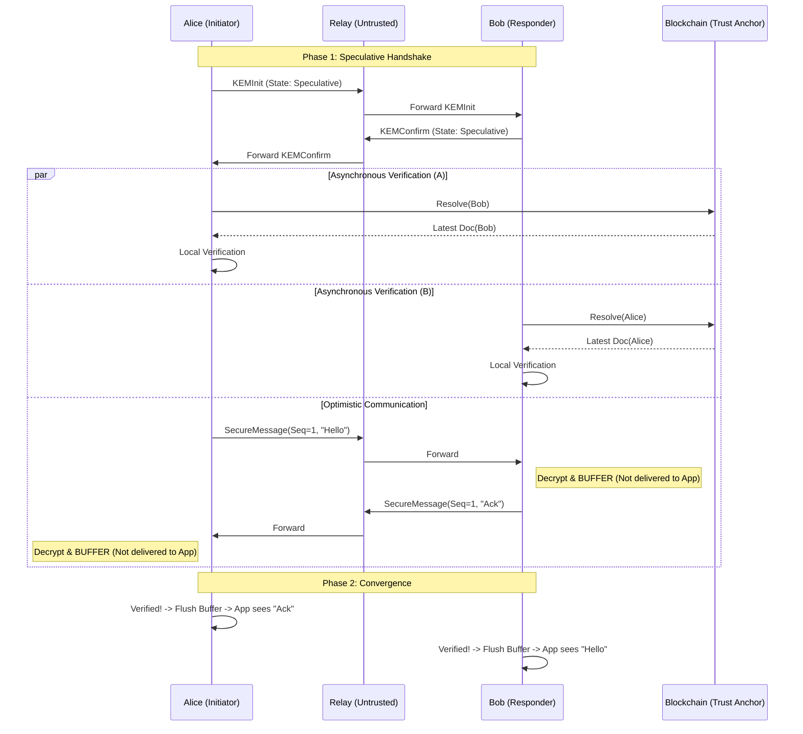

# QLink 协议规范 (QLink Protocol Specification)

> **版本:** 1.0.0 (Minimalist AKE Core)
> **状态:** 协议草案 (Draft Standard)
> **传输层:** TCP (Length-Prefixed) + Protobuf
> **安全模型:** 后量子、零信任中继、自主验证 (Self-Sovereign Verification)

---

## 1. 摘要 (Executive Summary)

QLink 是一种去中心化的认证密钥交换 (AKE) 协议。其核心创新在于解决了去中心化身份 (DID) 网络中的 **“安全-延迟悖论”**。通过引入 **推测式执行 (Speculative Execution)** 和 **异步身份验证 (Asynchronous Verification)**，QLink 实现了 0-RTT 的会话启动速度，同时保证了强一致性的后量子安全底线。

---

## 2. 协议状态机 (Protocol State Machine)

QLink 的安全性建立在严格的状态机逻辑之上。状态机不仅控制信令交互，更作为 **“应用层数据隔离闸门 (Data Isolation Gate, DIG)”** 控制明文消息的交付。

### 2.1 会话状态定义 (Session States)

| 状态 (State) | 符号 | 描述 | 数据处理策略 |
| :--- | :--- | :--- | :--- |
| **初始态 (IDLE)** | $S_{idle}$ | 会话尚未建立。 | 不允许收发。 |
| **推测态 (SPECULATIVE)** | $S_{spec}$ | 握手基于本地缓存完成，异步查链中。 | **允许发送**；**隔离接收**（解密但不交付应用层）。 |
| **确权态 (VERIFIED)** | $S_{ver}$ | 后台查链完成，身份已获账本真值验证。 | **全双工交付**（开放闸门，推送隔离缓冲区消息）。 |
| **中止态 (ABORTED)** | $S_{abort}$ | 验证失败或协议违规，会话永久失效。 | **物理熔断**（销毁密钥，清空隔离缓冲区，关闭连接）。 |

### 2.2 状态转换逻辑 (State Transitions)

1.  **$S_{idle} \to S_{spec}$ (乐观转换)**: 
    *   **触发条件**: 命中本地 DID 缓存并成功发出 `KEMInit` (发起方) 或成功解密 `KEMInit` (响应方)。
    *   **动作**: 初始化密钥链，启动后台异步验证线程。
2.  **$S_{idle} \to S_{ver}$ (保守转换)**:
    *   **触发条件**: 缓存未命中，完成阻塞式链上查询后建立会话。
3.  **$S_{spec} \to S_{ver}$ (确权升级)**:
    *   **触发条件**: 接收并验证通过来自共识层的真实性证明 (Proof of Authenticity)，包括但不限于 SPV 证明、聚合签名 QC 或 ZK 证明。
    *   **原子动作 (Normative)**: 实现必须保证 **原子性**。在转换状态前，必须先按序 (`Sequence Number`) 推送隔离缓冲区所有消息至应用层，随后立即切换至 $S_{ver}$ 模式以处理后续实时消息。
4.  **$S_{spec} \to S_{abort}$ (安全熔断)**:
    *   **触发条件**: 后台验证返回 `Mismatch` 或收到对端的 `ERROR_VERIFICATION_FAILED` 状态包。
    *   **动作**: 立即销毁内存密钥，清空隔离缓冲区，物理断开 TCP 连接。

---

## 3. 核心机制 (Core Mechanisms)

### 3.1 自主验证与证据驱动原则 (Autonomous & Evidence-Driven Verification)

协议规定：通信双方**不依赖**对端提供的版本声明，必须独立通过获取共识层证据 (Consensus Evidence) 验证对端的身份。

*   **发起方 (A)**：使用其认为“最新”的 B 公钥发起握手。
*   **响应方 (B)**：使用其认为“最新”的 A 公钥验证请求并响应。
*   **证据校验**：双方各自启动异步过程，获取包含 Merkle 路径或聚合签名的真实性证明。
*   **最终一致性确认**：在 $T_{chain}$ 时间窗口内完成证据校验，从而保障最终应用层认证完整性 (Eventual Application-Layer Authenticity, EALA)。

### 3.2 数据隔离策略 (Data Isolation Policy)

处于 $S_{spec}$ 状态时，协议栈必须维持一个 **隔离缓冲区 (Isolation Buffer)**。

*   **入站处理 (Normative)**: 收到 `SecureMessage` 后，Ratchet 演化密钥并执行 AES-GCM 解密，但解密后的明文**严禁 (MUST NOT)** 交付给应用层回调。

### 3.3 主动错误传播 (Proactive Error Propagation)

为了缩短全网的安全风险窗口，协议引入了主动告警机制：
*   一旦任一端在异步验证中检测到失败，在物理断开前，**应当 (SHOULD)** 尝试发送一个 `Packet_Status` (Code: `ERROR_VERIFICATION_FAILED`) 给对端。
*   对端接收到此特定状态包后，必须立即同步进入 $S_{abort}$ 逻辑，即使其自身的异步验证尚未完成。

---

## 4. 协议流程 (Protocol Flow)

---

## 5. 实现建议与注意事项 (Implementation Considerations)

本章节不属于核心协议约束，仅作为工程实现的指导建议。

### 5.1 内存水位线 (Memory High-Water Mark)
由于 $S_{spec}$ 状态下的消息被存储在隔离缓冲区中，实现应当设置合理的 **内存水位线**（如 100 条消息或一定容量）。若在背景验证完成前缓冲区溢出，建议实现主动触发 $S_{abort}$ 以防止内存耗尽攻击 (DoS)。

### 5.2 查链频率控制 (Resolution Throttling)
为了减轻区块链基础设施的压力，实现应当对同一 DID 的解析请求频率进行限制，并配合本地缓存 TTL 使用。

---

## 6. 基础设施扩展 (Optional Extensions)

*   **DID 解析代理**: 定义 `DIDDocumentRequest/Response` 允许通过中继进行代理查询，但客户端必须在收到响应后自行验证文档签名。
*   **PQC 证书扩展**: 支持将 Dilithium 等签名算法集成至 DID Document 证明中。
